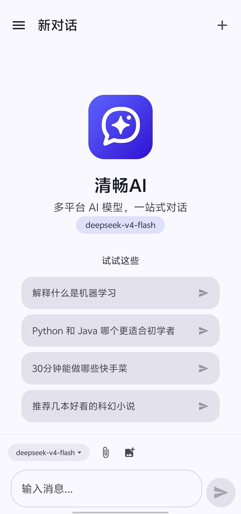
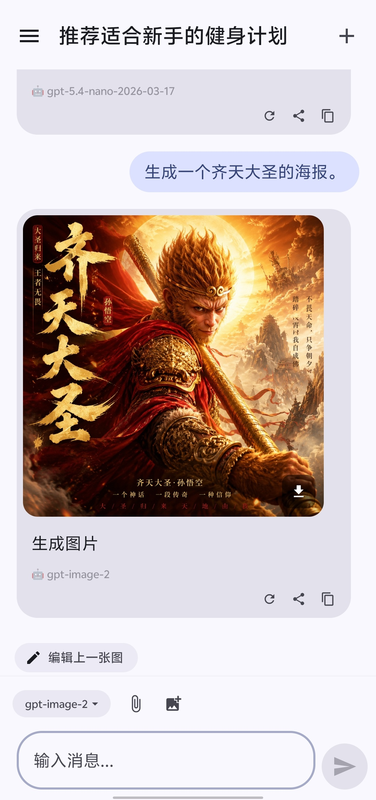
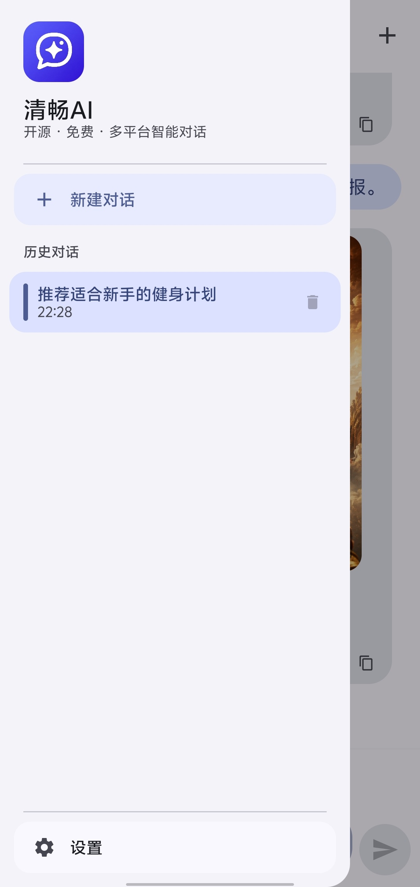
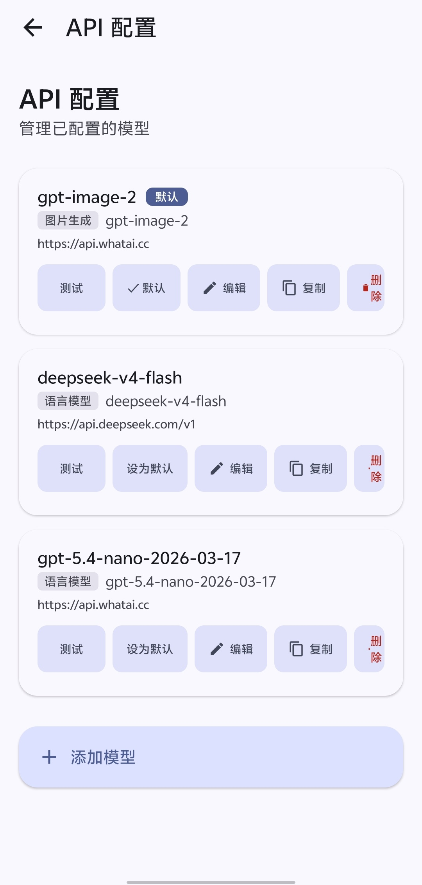
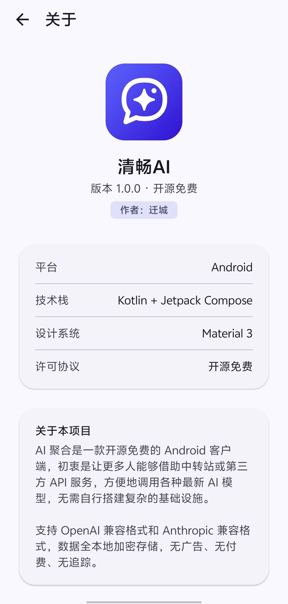

# 清畅AI — 开源多平台 AI 聚合客户端

清畅AI 是一款开源免费的 Android AI 聚合 App。支持 OpenAI / Anthropic 兼容格式，可对接 ChatGPT 最新图像模型（gpt-image-1 / ChatGPT Images 2.0）以及 DeepSeek、通义千问、智谱、豆包等主流模型。

**通过中转平台调用 API，比直接在 App 开 Pro 会员划算得多——生成一张图不到一毛钱。**

---

## 预览

| 聊天 | 侧边栏 |
|------|------|
|  |  |

| 设置 | 模型管理 |
|------|------|
|  |  |

| 图片生成 |
|------|
|  |

---

## 特性

### 聊天
- 流式对话 (SSE)，支持 OpenAI + Anthropic 格式
- 多模态识图（GPT-4V / Claude Vision / GLM-4V 等视觉模型）
- 多轮对话，上下文自动截断
- 重新生成回复
- JSON 结构化输出模式
- Token 用量统计显示
- Markdown 渲染（彩色标题、粗体、斜体、代码块、列表、引用、表格、待办、分隔线）

### 图片
- 图片生成（ChatGPT Images 2.0 / gpt-image-1 / DALL·E 兼容）
- 图片编辑（DALL·E 2 兼容）
- 图片下载保存到相册
- 图片全屏查看 + 双指缩放
- 拍照即时上传 / 相册选择

### 管理
- 多平台 / 多模型配置（11 个官方平台）
- 厂商预设 + 自定义
- 一键复制模型配置（自动副本编号）
- 编辑 / 删除 / 设为默认
- 模型连通性测试
- 对话历史本地加密存储
- 按时间范围清除记录

### 体验
- Material 3 设计系统
- 深色 / 浅色主题 / 中英文切换
- 打字动画 / 加载进度条 / 流式光标
- 分享消息 / 复制消息

---

## 💰 为什么比 Pro 会员划算？

| 方式 | 费用 |
|------|------|
| ChatGPT Plus 会员 | $20/月（≈ ¥145） |
| Claude Pro 会员 | $20/月（≈ ¥145） |
| **中转站 API + 清畅AI** | 按量计费，一张图约 ¥0.05~0.10，聊天几乎免费 |

开一个月会员的钱，用 API 方式够你生成上千张图。而且不受平台限制，ChatGPT / Claude / DeepSeek 随便切换。

---

## 支持的平台

| 平台 | 聊天 | 识图 | 生图 |
|------|:--:|:--:|:--:|
| OpenAI（GPT-4o / gpt-image-1） | ✅ | ✅ | ✅ |
| DeepSeek（V3 / R1） | ✅ | ❌ | ❌ |
| Anthropic（Claude 3.5 / 4） | ✅ | ✅ | ❌ |
| 通义千问（Qwen） | ✅ | ✅ | ❌ |
| 智谱 GLM | ✅ | ✅ | ❌ |
| Moonshot Kimi | ✅ | ✅ | ❌ |
| 豆包（字节） | ✅ | ✅ | ❌ |
| 零一万物 | ✅ | ✅ | ❌ |
| MiniMax | ✅ | ✅ | ❌ |
| 阶跃星辰 | ✅ | ✅ | ❌ |
| 百川 | ✅ | ❌ | ❌ |

通过 One API / New API / OpenRouter 等中转平台可间接支持 300+ 模型。

---

## 技术栈

Kotlin · Jetpack Compose · Material 3 · OkHttp + SSE · kotlinx.serialization · Coil · EncryptedSharedPreferences · DataStore

---

## 构建

```bash
# Android Studio + JDK 17+
./gradlew assembleDebug
```

最低 Android 8.0 | 目标 Android 15

---

## 许可

开源免费，数据全本地加密存储。无广告、无付费、无追踪。

## 作者

迁城

---

**清畅AI — 方便在手机上用最新的各种模型。**
